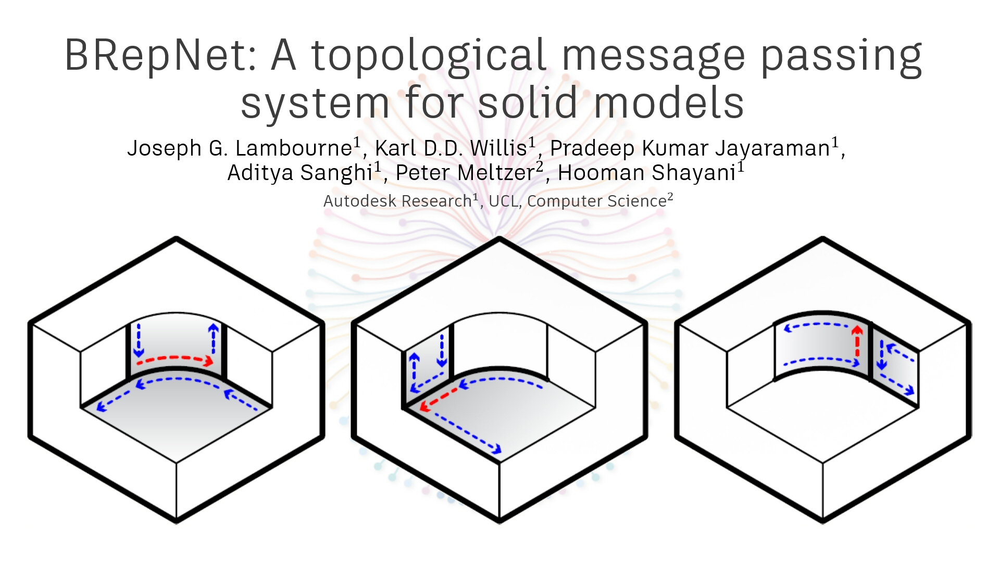
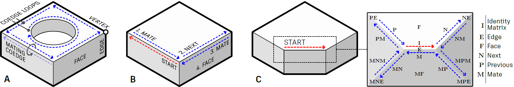
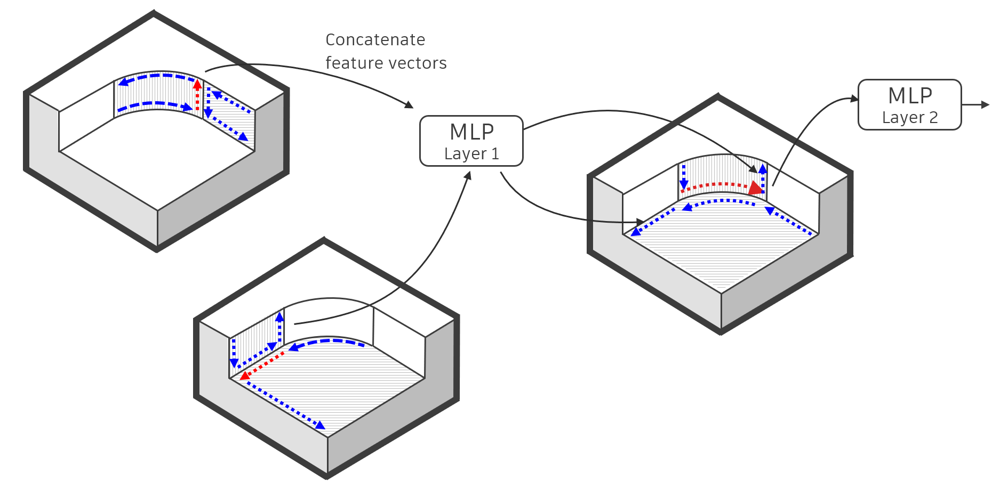

# BRepNet: A topological message passing system for solid models

This repository contains the an implementation of [BRepNet: A topological message passing system for solid models](https://arxiv.org/pdf/2104.00706.pdf).



## About BRepNet
BRepNet is a neural network specifically designed to operate on solid models.  It uses additional topological information present in the boundary representation (B-Rep) data structure to perform convolutions in a way which is not possible for arbitrary graphs.  As B-Reps describe manifolds, they contain additional topological information which includes the ordering of edges around faces as well as the face adjacency.  The topology is defined using oriented edges called coedges.  Each coedge maintains an adjacency relationship with the next and previous coedge around its parent face, the mating coedge on the adjacent face, the parent face and the parent edge.



Using this information, we can identify faces, edges and coedges in the neighborhood of some starting coedge (red), using topological walks.   A topological walk is a series of instructions we move us from the starting coedge to a nearby entity.  In the figure above (B) the we show a walk from the red starting coedge to its mating coedge, to the next coedge in the loop, to mating coedge and finally to the parent face.  Using multiple topological walks we can define a group of entities in the neighborhood of the starting coedge.  The instructions which define the neighboring entities are marked in the figure (C).  The BRepNet implementation allows you to define any group of entities using a _kernel_ file.  See [here](kernels/winged_edge_plus.json) for an example of a kernel file for kernel entities shown above. 



The BRepNet convolution algorithm concatenates feature vectors from the entities defined in the kernel file relative to the starting coedge (red).  The resulting vector is passed through an MLP and the output becomes the hidden state for this coedge in the next network layer.  The procedure is repeated for each coedge in the model, then new hidden state vectors for the faces and edges are generated by pooling the coedge hidden states onto their parent faces and edges.  See [the paper](https://arxiv.org/pdf/2104.00706.pdf) for more details.  The actual implementation of the BRepNet convolution can been seen in the [BRepNetLayer.forward()](models/brepnet.py) method.

## Citing this work

```
@inproceedings{lambourne2021brepnet,
 title = {BRepNet: A Topological Message Passing System for Solid Models},
 author = {Joseph G. Lambourne and Karl D.D. Willis and Pradeep Kumar Jayaraman and Aditya Sanghi and Peter Meltzer and Hooman Shayani},
 eprint = {2104.00706},
 eprinttype = {arXiv},
 eprintclass = {cs.LG},
 booktitle = {IEEE Conference on Computer Vision and Pattern Recognition (CVPR)},
 year = {2021}
}
```

## Quickstart
### Setting up the environment

```
git clone https://github.com/AutodeskAILab/BRepNet.git
cd BRepNet
conda env create -f environment.yml
conda activate brepnet
```

For GPU training you will need to change the pytorch install to include your cuda version.  i.e.
```
conda install pytorch cudatoolkit=11.1 -c pytorch -c conda-forge
```

For training with multiple workers you may hit errors of the form `OSError: [Errno 24] Too many open files`.  In this case you need to increase the number of available file handles on the machine using 
```
ulimit -Sn 10000
```
I find I need to set the limit to 10000 for 10 worker threads.

### Download the dataset
You can download the step distribution of the [Fusion 360 Gallery segmentation dataset](https://github.com/AutodeskAILab/Fusion360GalleryDataset) from [this link](https://fusion-360-gallery-dataset.s3-us-west-2.amazonaws.com/segmentation/s2.0.0/s2.0.0.zip).   The zip is 3.2Gb.   Alternatively download using curl

```
cd /path/to/where_you_keep_data/
curl https://fusion-360-gallery-dataset.s3-us-west-2.amazonaws.com/segmentation/s2.0.0/s2.0.0.zip -o s2.0.0.zip
unzip s2.0.0.zip
```

If you are interested in building your own dataset using other step files then the procedure is documented [here](docs/building_your_own_dataset.md)

### Processing the STEP data
Run the quickstart script to extract topology and geometry information from the step data ready to train the network.
```
cd BRepNet/
python -m pipeline.quickstart --dataset_dir /path/to/where_you_keep_data/s2.0.0 --num_workers 5
```
This may take up to 10 minutes to complete.

### Training the model
You are then ready to train the model.  The quickstart script should exit telling you a default command to use which should be something like
```
python -m train.train \
  --dataset_file /path/to/where_you_keep_data/s2.0.0/processed/dataset.json \
  --dataset_dir  /path/to/where_you_keep_data/s2.0.0/processed/ \
  --max_epochs 50
```

You may want to adjust the `--num_workers` and `--gpus` parameters to match your machine.  The model runs with the pytorch-lightning `ddp-spawn` mode, so you can choose either 1 worker thread and multiple gpus or multiple threads and a single gpu.   The options and hyper-parameters for BRepNet can be seen in `BRepNet.add_model_specific_args` in [brepnet.py](models/brepnet.py).   For a full list of all hyper-parameters including those defined in pytorch-lightning see

```
python -m train.train --help
```

### Monitoring the loss, accuracy and IoU
By default BRepNet will log data to tensorboard in a folder called `logs`.   Each time you run the model the logs will be placed in a separate folder inside the `logs` directory with paths based on the date and time.  At the start of training the path to the log folder will be printed into the shell.  To monitory the process you can use
```
cd BRepNet
tensorboard --logdir logs
```
A trained model is also saved every time the validation loss reaches a minimum.  The model will be in the same folder as the tensorboard logs

```
./logs/<date>/<time>/checkpoints
```

## Testing the network

```
python -m eval.test \
  --dataset_file /path/to/dataset_file.json \
  --dataset_dir /path/to/data_dir \
  --model BRepNet/logs/<day>/<time>/checkpoints/epoch=x-step=x.ckpt
```

## Visualizing the segmentation data
You can visualize the segmentation data using a Jupyter notebook and the tools in the [visualization](visualization) folder. An example of how to view the segmentation information in the dataset is [here](notebooks/step_viewer_example.ipynb).

## Evaluating the segmentation on your own STEP data
To evaluate the model on you own step data you can use the script [evaluate_folder.py](eval/evaluate_folder.py)

```
python -m eval.evaluate_folder  \
  --dataset_dir ./example_files/step_examples
  --dataset_file ./example_files/feature_standardization/s2.0.0_step_all_features.json \
  --model ./example_files/pretrained_models/pretrained_s2.0.0_step_all_features_0519_073100.ckpt
```
This will loop over all step or stp files in `./example_files/step_examples` and create  "logits" files in `example_files/step_examples/temp_working/logits`.  The logits files contain one row for each face in the step data.  The columns give the probabilities that the corresponding face belongs to a given segment.

The notebook [find_and_display_segmentation.ipynb](notebooks/find_and_display_segmentation.ipynb) runs through the entire process of evaluating the model and displaying the predicted segmentation.

## Running the tests
If you need to run the tests then this can be done using 

```
python -m unittest
```

## The new data-pipeline based on Open Cascade
The original BRepNet pipeline used proprietary code to process data from solid models and convert these to network input.  In an effort to make this BRepNet as reusable as possible we have converted this pipeline to work with Open Cascade and [python OCC](https://github.com/tpaviot/pythonocc-core).  As with any kind of translation between solid model formats, the translation to step introduces some differences in the data.  These are documented [here](docs/differences_in_open_cascade_pipeline.md).  When training with the default options given above you will obtain very similar numbers to the ones published.

## License
Shield: [![CC BY-NC-SA 4.0][cc-by-nc-sa-shield]][cc-by-nc-sa]

This work is licensed under a
[Creative Commons Attribution-NonCommercial-ShareAlike 4.0 International License][cc-by-nc-sa].

[![CC BY-NC-SA 4.0][cc-by-nc-sa-image]][cc-by-nc-sa]

[cc-by-nc-sa]: http://creativecommons.org/licenses/by-nc-sa/4.0/
[cc-by-nc-sa-image]: https://licensebuttons.net/l/by-nc-sa/4.0/88x31.png
[cc-by-nc-sa-shield]: https://img.shields.io/badge/License-CC%20BY--NC--SA%204.0-lightgrey.svg