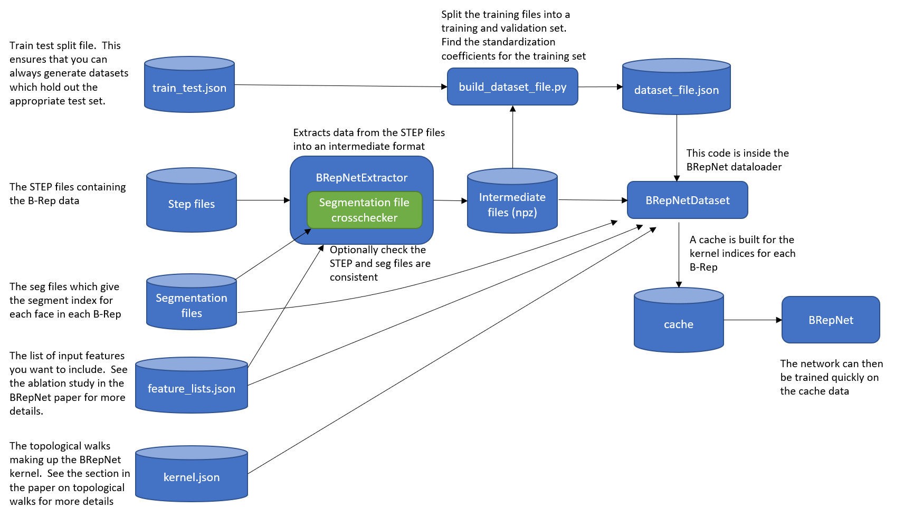

# Building your own dataset

## The BRepNet data pipeline
The BRepNet data processing pipeline is described in the diagram below.



First the topology and geometric features are read from the STEP files and processed into an intermediate numpy format.  Optionally you can provide the segmentation files, which will be cross checked against the data when loaded into Open Cascade to ensure that the number of faces remains consistent.   For more details see the section [Processing the STEP data](#Processing-the-STEP-data)

The next stage in the process is the generation of a dataset file.  This defines which files are in the training, validation
and test sets.  It also contains the feature standardization coefficients derived from the training set.  Is you want to use the official train/test split for the Fusion Gallery segmentation dataset then the `train_test.json` file can be optionally provided as an argument here.   If a `train_test.json` is not provided then one will be automatically created in the step folder in case you need to re-generate the dataset keeping the test test the same.   

The generated dataset file is needed in the training process.  It contains statistics from the training set which are used for feature standardization.   

Finally the BRepNet [dataloader code](../dataloaders/brepnet_dataset.py) will read the intermediate files and compute the index arrays which the network requires.  These depend on the kernel file chosen.  The results are cached during the first epoch and will be reused thereafter.  


## Processing the STEP data
The script [extract_brepnet_data_from_step.py](../pipeline/extract_brepnet_data_from_step.py) reads the step files and generates the intermediate data.

```
python -m pipeline.extract_brepnet_data_from_step \
    --step_path /data_drive/s2.0.0_step/step \
    --output /data_drive/s2.0.0_step/processed \
    --feature_list feature_lists/all.json \
```
### Arguments
`--step_path` Path to load the step files from

`--output` Path to the save intermediate brep data

`--feature_list` The list of features you would like to extract from the STEP data.  See [here](../feature_lists) for the feature lists used in the ablation studies in the paper. 

`--num_workers` The number of worker threads

`--mesh_dir` Optionally cross check with Fusion Gallery mesh files to check the segmentation labels

`--seg_dir` Optionally cross check the seg files (labels) you are using contain one label for each face   

## Building the dataset file
The dataset file can be built using the script [build_dataset_file.py](../pipeline/build_dataset_file.py)

```
python -m pipeline.build_dataset_file \
    --npz_folder /media/data/FusionGallerySegmentation/processed \
    --train_test /media/data/FusionGallerySegmentation/s1.0.0/train_test.json \
    --dataset_file  /media/data/FusionGallerySegmentation/step_dataset.json
```
### Arguments
`--npz_folder` Path to the folder containing npz files from `extract_brepnet_data_from_step.py`

`--dataset_file` The pathname for the dataset file you want to generate

`--train_test` Optionally you can use a pre-defined test set by including the path to a `train_test.json` file

`--test_split` If a `train_test.json` file is not given then the size of the test set can be defined with this value.  Notice that the validation set will be extracted from the remaining training data after the held out test set has been generated.

`--validation_split` This defines the fraction of the training set assigned for validation.  This second split of data is made *after* the held out test set has been chosen.
