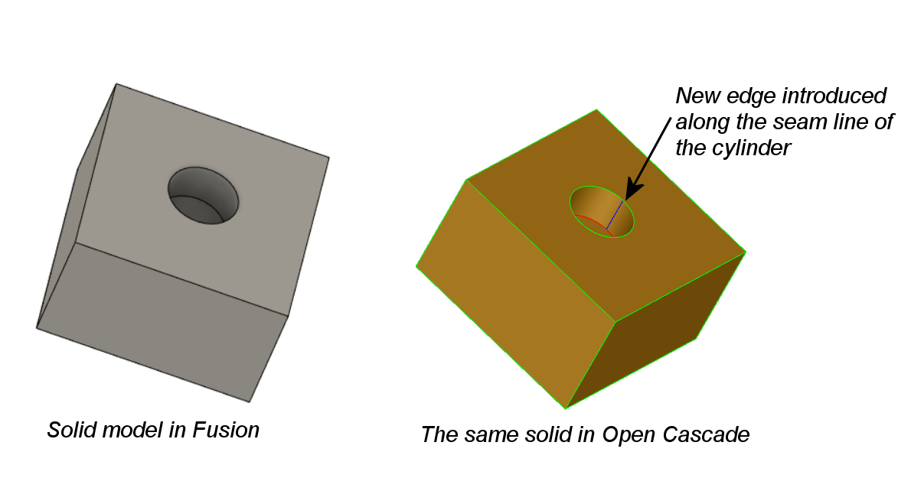
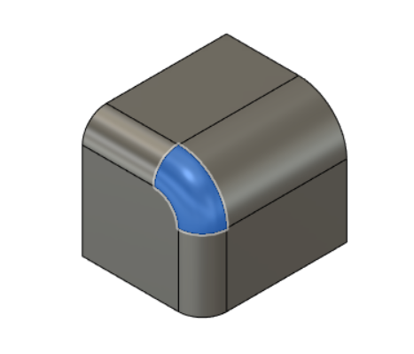

# Differences between the Open Cascade pipeline and results in the paper
## Splitting along seam lines
The conversion from the Autodesk Shape Manager format to STEP causes splitting of spheres, cylinders and cones along a "seam lines".   These are the lines on the periodic surfaces which have parameter values 0.0 (and 2*pi).

For a solid cylinder this has the effect of connecting the two loops on the periodic cylindrical face with a new edge.  This topological change connects the edge graph for holes as shown above.  

## Toroidal surfaces
We notice than in some cases conversion from the Autodesk Shape Manager format to STEP causes toroidal surfaces to be converted to rational nurbs surfaces.  In some cases toroidal surfaces are still preserved, but they are converted for the "suitcase corner" fillets shown below.

## Helical and intersection curves
Helical and intersection curves are not supported by Open Cascade.  There are no helical curves in the Fusion 360 Gallery segmentation dataset.  For the Open Cascade dataloader we modify the helical curve and intersection curve features to look for rational and non-rational B-Spline curves.  We assume that intersection curves will get splined and we want to maintain the same number of edge features.  See [feature_lists/all.json](../feature_lists/all.json) for the features which are currently used.